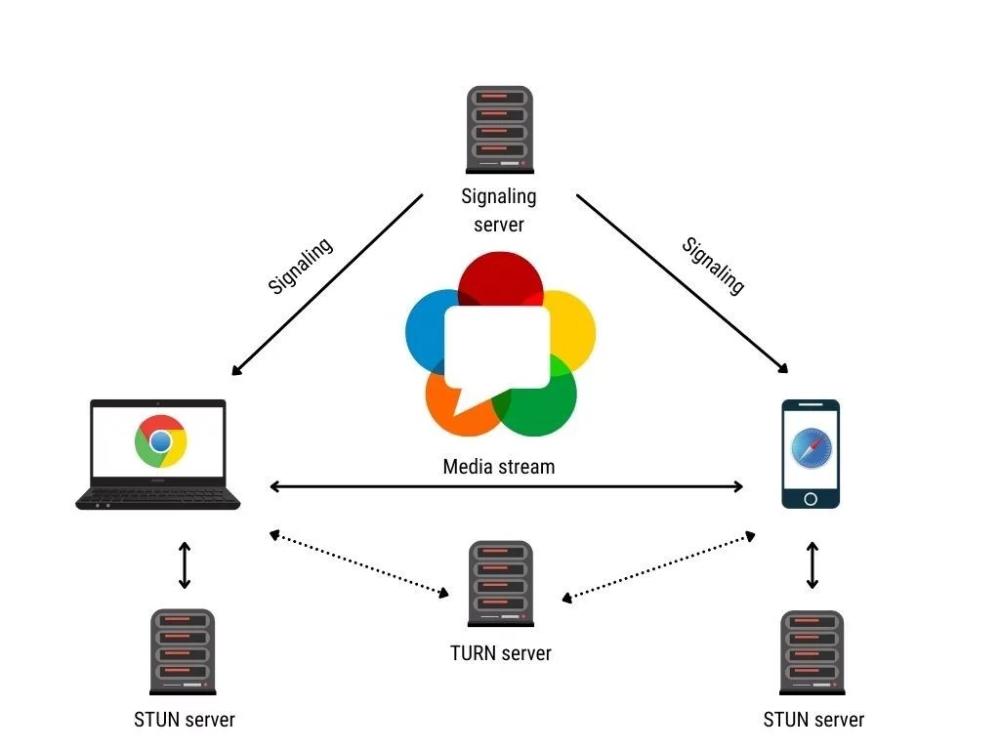
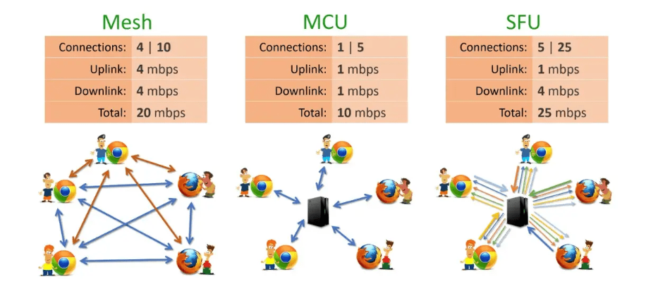

## WebRTC(Web Real-Time Communication) 란?
- 웹 브라우저 간에 플러그인 도움없이 서로 통신할 수 있도록 설계 된 API

## 구현 방식

1. **Mesh 방식**
- 전형적인 `P2P` 방식
- Media Server 필요 X
- 1:1연결 혹은 소규모 연결에 적합
- **장점**
    - 서버 자원 적게 사용
    - 직접적으로 Peer간 연결 → 실시간성 보장
- **단점**
    - N명이 접속한 화상회의라면, N-1개 연결 유지
        
        ⇒ Peer 수 ↑ → Client side 과부하 ↑
        

2. **MCU(Mult-point Control Unit) 방식**
- 다수의 송출 미디어 데이터를 `Media Server` 에서 혼합(muxing) 또는 가공(transcoding)하여 수신 측에 전달
- P2P 방식 X
- **장점**
    - 클라이언트 부하 ↓
    - N:M 구조 가능
- **단점**
    - 실시간성 저해
    - 구현 난이도 ↑
    - 서버 자원 많이 사용

3. **SFU(Selective Forwarding Unit) 방식**
- 각각의 Client 간 미디어 트래픽을 중계하는 `Media Server` 를 두는 방식
- P2P 방식 X
- Server에게 자신의 데이터를 보내고, 방대방의 수만큼 데이터를 받는 방식
- 1:N 혹은 소규모 N:M 형식의 실시간 스트리밍에 적합
- **장점**
    - Mesh 방식과 비슷한 수준의 실시간성 유지 가능
    - Mesh 방식보다 Client 부하 ↓
- **단점**
    - Mesh 방식보다 속도 ↓
    - Mesh 방식보다 Server 부하 ↑
    - 대규모 N:M 구조에는 여전히 Client 부하 ↑

## Signaling Server
- Channel Server(WebSocket) + Session Server
- Peer들을 연결 시키기 위해 필요한 정보
    - Session Control Messages
    - Error Messages,
    - Codec
    - Bandwith
- 위 정보들을 각각의 Peer들에게 전달하고 중계해주는 역할
- 주로 `WebSocket` 사용하여 직접 구현
    
    <aside>
    💡 Signaling Server WebSocket 통신
    
    1. A가 연결에 필요한 데이터를 Signaling Server에 전송
        ⇒ `Signaling Offer`
    2. Signaling Server에 연결된 모든 세션들에게 A 데이터 전달
    3. B에서 A 데이터를 활용해서 연결에 필요한 작업을 한 후,
        B 데이터를 Signaling Server에 전송
        ⇒ `Signaling Answer`
    4. A 세션에게 B 데이터를 전달
    5. 각각의 데이터를 활용해 WebRTC가 A와 B를 연결
    
    </aside>
    
- 방화벽, NAT 환경에 놓여있는 Peer에 대해서는 직접적인 Signaling 불가능
    
    → STUN Server, TURN Server 필요
    

## STUN(Session Traversal Utilites for NAT) Server
- Peer의 `Public IP`를 알려주는 서버
- 주로 오픈 소스 활용
- STUN Server를 사용해도 보호정책이 강한 NAT나 라우터
    
    (주로 Symmetric NAT 환경)에선 Signaling 불가능
    
    → TURN Server 필요
    

## TURN(Traversal Using Relays around NAT) Server
- Symmetric NAT 제한을 우회할 수 있게 도와줌
- Peer간의 통신 채널을 중계해주는 역할
- WebRTC의 가능 큰 특징인 `P2P` 방식에서 벗어나짐
- Local IP와 Public IP 로도 연결할 수 없는 경우 TURN Server 사용
- 직접 구축 또는 `COTURN` 오픈 소스 활용

## Media Server
- 미디어 트래픽을 관리하여 각 Peer에게 다시 배포해주는 멀티미디어 미들웨어
- **장점**
    - Client 부하 ↓
- **단점**
    - Server 부하 ↑
    - 구현 난이도 ↑
