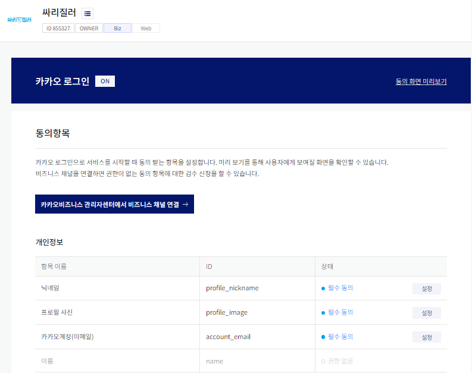

# 포팅 매뉴얼

### 1. 기술 스택

1. Backend
   - JAVA 11
   - SpringBoot 2.7.7
   - OAUTH 2.0
   - Spring Security 5.7.6
   - Spring Data JPA
   - Mysql - 8.0.31
   - Redis 7.0.8
2. Frontend
   - Next.js 13.1.1
   - SCSS
   - TypeScript
   - HTML5

### 2. 배포

Docker

```
# Docker 설치하기
## 이전 Docker 있으면 삭제
$ sudo apt-get remove docker docker-engine docker.io containerd runcCopy

## Docker engine 설치에 필요한 툴 설치
$ sudo apt update
$ sudo apt-get install -y ca-certificates \
    curl \
    software-properties-common \
    apt-transport-https \
    gnupg \
    lsb-release

$ sudo mkdir -p /etc/apt/keyrings
$ curl -fsSL https://download.docker.com/linux/ubuntu/gpg | sudo gpg --dearmor -o /etc/apt/keyrings/docker.gpg
$ echo "deb [arch=$(dpkg --print-architecture) signed-by=/etc/apt/keyrings/docker.gpg] https://download.docker.com/linux/ubuntu $(lsb_release -cs) stable" | sudo tee /etc/apt/sources.list.d/docker.list > /dev/null

## Docker engine 설치
$ sudo apt-get update
$ sudo apt-get install docker-ce docker-ce-cli containerd.io
$ cat <<EOF | sudo tee /etc/docker/daemon.json
{
  "exec-opts": ["native.cgroupdriver=systemd"],
  "log-driver": "json-file",
  "log-opts": {
    "max-size": "100m"
  },
  "storage-driver": "overlay2"
}
EOF

## Docker 권한 설정
$ curl -fsSL https://get.docker.com/ | sudo sh
$ sudo usermod -aG docker $USER
$ newgrp docker

# Docker Compose 설치
$ sudo apt-get update
$ sudo apt-get install docker-compose-plugin

## 설치 확인
$ docker compose version
```

K8S (minikube)

```
# K8S 설치 (MINIKUBE)

# Minikube 설치
$ curl -Lo minikube https://storage.googleapis.com/minikube/releases/latest/minikube-linux-amd64 && chmod +x minikube
$ sudo mkdir -p /usr/local/bin/
$ sudo install minikube /usr/local/bin/

### Minikube 설치 확인
$ minikube version

## Minikube driver 설정
$ minikube start --driver=docker


# kubectl 설치하기 -> K8S에 명령어 전달
$ curl -LO "https://storage.googleapis.com/kubernetes-release/release/$(curl -s https://storage.googleapis.com/kubernetes-release/release/stable.txt)/bin/linux/amd64/kubectl"
$ chmod +x ./kubectl
$ sudo mv ./kubectl /usr/local/bin/kubectl

```

Docker Image 다운로드 및 실행

MySQL

```
# mysql docker로 실행
$ docker run --name mysql-container -v /opt/lib/mysql:/var/lib/mysql -d -e MYSQL_ROOT_PASSWORD=test1234 -p 3306:3306 mysql
$ docker exec -it mysql-container bash

# 비밀번호 입력 -> 위에서 설정한 비밀번호 입력(test1234)
$ mysql -u root -p
$ use mysql;
# 유저 생성
$ create user 'ssafy'@'%' identified with mysql_native_password by 'ssafy';
$ grant all privileges on *.* to 'ssafy'@'%' with grant option;
$ flush privileges;
```

K8S 설정

yaml 작성

redis.yaml

```
apiVersion: v1
kind: ConfigMap
metadata:
  name: redis-config
data:
  redis-config: |
    maxmemory 20mb
    maxmemory-policy allkeys-lru
---
apiVersion: v1
kind: Service
metadata:
  name: redis
  labels:
    app: redis
spec:
  selector:
    app: redis
  type: NodePort
  ports:
  - name: redis
    protocol: TCP
    port: 6379
    targetPort: 6379
    nodePort: 31006
---
apiVersion: v1
kind: Pod
metadata:
  name: redis
  labels:
      app: redis
spec:
  containers:
  - name: redis
    image: redis:latest
    command:
      - redis-server
      - "/redis-master/redis.conf"
    env:
    - name: MASTER
      value: "true"
    ports:
    - containerPort: 6379
      name: redis
    volumeMounts:
    - mountPath: /redis-master-data
      name: data
    - mountPath: /redis-master
      name: config
  volumes:
    - name: data
      emptyDir: {}
    - name: config
      configMap:
        name: redis-config
        items:
        - key: redis-config
          path: redis.conf
```

Business-server.yaml

```
apiVersion: apps/v1
kind: Deployment
metadata:
  name: business
spec:
  selector:
    matchLabels:
      app: business-server
      tier: app
  template:
    metadata:
      labels:
        app: business-server
        tier: app
    spec:
      containers:
        - name: business-server
          image: sudocker940305/cicd-pjt:business
          imagePullPolicy: Always
          ports:
            - containerPort: 8080
              protocol: TCP

      imagePullSecrets:
        - name: sudocker

---
apiVersion: v1
kind: Service
metadata:
  name: business
spec:
  type: NodePort
  ports:
    - port: 8080
      nodePort: 31000
      protocol: TCP
  selector:
    app: business-server
    tier: app
```

Ranking-server.yaml

```
apiVersion: apps/v1
kind: Deployment
metadata:
  name: ranking
spec:
  selector:
    matchLabels:
      app: ranking-server
      tier: app
  template:
    metadata:
      labels:
        app: ranking-server
        tier: app
    spec:
      containers:
        - name: ranking-server
          image: sudocker940305/cicd-pjt:ranking
          imagePullPolicy: Always
          ports:
            - containerPort: 8050
              protocol: TCP

      imagePullSecrets:
        - name: sudocker

---
apiVersion: v1
kind: Service
metadata:
  name: ranking
spec:
  type: NodePort
  ports:
    - port: 8050
      nodePort: 31005
      protocol: TCP
  selector:
    app: ranking-server
    tier: app
```

Session-server.yaml

```
apiVersion: apps/v1
kind: Deployment
metadata:
  name: session
spec:
  selector:
    matchLabels:
      app: session-server
      tier: app
  template:
    metadata:
      labels:
        app: session-server
        tier: app
    spec:
      containers:
        - name: session-server
          image: sudocker940305/cicd-pjt:session
          imagePullPolicy: Always
          ports:
            - containerPort: 8070
              protocol: TCP

      imagePullSecrets:
        - name: sudocker

---
apiVersion: v1
kind: Service
metadata:
  name: session
spec:
  type: NodePort
  ports:
    - port: 8070
      nodePort: 31002
      protocol: TCP
  selector:
    app: session-server
    tier: app
```

Webrtc-server.yaml

```
apiVersion: apps/v1
kind: Deployment
metadata:
  name: webrtc
spec:
  selector:
    matchLabels:
      app: webrtc-server
      tier: app
  template:
    metadata:
      labels:
        app: webrtc-server
        tier: app
    spec:
      containers:
        - name: webrtc-server
          image: sudocker940305/cicd-pjt:webrtc
          imagePullPolicy: Always
          ports:
            - containerPort: 5000
              protocol: TCP

      imagePullSecrets:
        - name: sudocker

---
apiVersion: v1
kind: Service
metadata:
  name: webrtc
spec:
  type: NodePort
  ports:
    - port: 5000
      nodePort: 31003
      protocol: TCP

  selector:
    app: webrtc-server
    tier: app
```

yaml 파일 실행

```
$ kubectl apply -f redis.yaml
$ kubectl apply -f Business-server.yaml
$ kubectl apply -f Ranking-server.yaml
$ kubectl apply -f Session-server.yaml
$ kubectl apply -f Webrtc-server.yaml
```

EC2 local에 배포

## apigateway

- /back/ssarijileo-apigateway/src/main/resources/application-jwt.yml 생성 후 아래 내용 추가

```
# jwt SsarijileoSecretKey 20 Fin
jwt:
  header: Authorization
  secret: U3NhcmlqaWxlb1NlY3JldEtleVNzYXJpamlsZW9TZWNyZXRLZXlTc2FyaWppbGVvU2VjcmV0S2V5U3NhcmlqaWxlb1NlY3JldEtleVNzYXJpamlsZW9TZWNyZXRLZXlTc2FyaWppbGVvU2VjcmV0S2V5U3NhcmlqaWxlb1NlY3JldEtleVNzYXJpamlsZW9TZWNyZXRLZXlTc2FyaWppbGVvU2VjcmV0S2V5U3NhcmlqaWxlb1NlY3JldEtleVNzYXJpamlsZW9TZWNyZXRLZXlTc2FyaWppbGVvU2VjcmV0S2V5U3NhcmlqaWxlb1NlY3JldEtleVNzYXJpamlsZW9TZWNyZXRLZXlTc2FyaWppbGVvU2VjcmV0S2V5U3NhcmlqaWxlb1NlY3JldEtleVNzYXJpamlsZW9TZWNyZXRLZXlTc2FyaWppbGVvU2VjcmV0S2V5U3NhcmlqaWxlb1NlY3JldEtleVNzYXJpamlsZW9TZWNyZXRLZXlGaW4=
  token-validity-in-seconds: 3600
```

- /back/ssarijileo-apigateway/src/main/resources/application.yml 내용을 아래 내용으로 변경

```
server:
  port: 8000

spring:
  # swagger
  mvc:
    pathmatch:
      matching-strategy: ANT_PATH_MATCHER

  # application-jwt
  profiles:
    include: jwt

  # API id for MSA & routes
  application:
    name: gateway-service
  cloud:
    gateway:

#      default-filters:
#        - AuthorizationHeaderFilter
      routes:
        - id: auth-service
          uri: http://localhost:8090
          predicates:
            - Path=/api/v1/user/**
          filters:
            - AuthorizationHeaderFilter
        - id: ssarijileo-service
          uri: http://192.168.49.2:31000
          predicates:
            - Path=/api/v1/song/**, /api/v1/song-setting/**, /api/v1/singing-contest/**, /api/v1/recording/**, /api/v1/singing/**, /api/v1/friend/**, /api/v1/profile/**
          filters:
            - AuthorizationHeaderFilter
        - id: webrtc-service
          uri: http://192.168.49.2:31003
          predicates:
            - Path=/api/v1/room/**, /api/v1/reservation/**
          filters:
            - AuthorizationHeaderFilter
        - id: ranking-service
          uri: http://192.168.49.2:31005
          predicates:
            - Path=/api/v1/ranking/**
          filters:
            - RankingFilter
        - id: notification-service
          uri: http://localhost:8060
          predicates:
            - Path=/api/v1/sse/**


# log level setting
logging:
  level:
    root: info
    com.ssafy: debug
    org.springframework.cloud.gateway: debug
    reactor.netty.http.client: debug
```

- /back/ssarijileo-apigateway에 들어갑니다.

```
chmod +x ./gradlew
sudo ./gradlew bootJar
nohup java -jar build/libs/ssarijileo-apigateway-0.0.1-SNAPSHOT.jar &
```

### auth

- /back/ssarijileo-auth/src/main/resources/application-oauth.yml 생성 후 아래 내용 추가
  - client-id, secret은 따로 넣어줘야함

```
spring:
  # OAuth2
  security:
    oauth2:
      client:
        registration:
          kakao:
            client-id: 아이디
            client-secret: 비밀번호
            # 요청 http://localhost:8090/oauth2/authorization/kakao
            # http://192.168.31.64:8090/oauth2/authorization/kakao
            redirect-uri: http://i8b302.p.ssafy.io:8090/login/oauth2/code/kakao
            # http://localhost:8090/login/oauth2/code/kakao
            authorization-grant-type: authorization_code
            client-authentication-method: POST
            client-name: Kakao
            scope:
              - profile_image
              - profile_nickname
              - account_email

        provider:
          kakao:
            authorization-uri: https://kauth.kakao.com/oauth/authorize
            token-uri: https://kauth.kakao.com/oauth/token
            user-info-uri: https://kapi.kakao.com/v2/user/me
            user-name-attribute: id


# jwt SsarijileoSecretKey 20 Fin
jwt:
  header: Authorization
  secret: U3NhcmlqaWxlb1NlY3JldEtleVNzYXJpamlsZW9TZWNyZXRLZXlTc2FyaWppbGVvU2VjcmV0S2V5U3NhcmlqaWxlb1NlY3JldEtleVNzYXJpamlsZW9TZWNyZXRLZXlTc2FyaWppbGVvU2VjcmV0S2V5U3NhcmlqaWxlb1NlY3JldEtleVNzYXJpamlsZW9TZWNyZXRLZXlTc2FyaWppbGVvU2VjcmV0S2V5U3NhcmlqaWxlb1NlY3JldEtleVNzYXJpamlsZW9TZWNyZXRLZXlTc2FyaWppbGVvU2VjcmV0S2V5U3NhcmlqaWxlb1NlY3JldEtleVNzYXJpamlsZW9TZWNyZXRLZXlTc2FyaWppbGVvU2VjcmV0S2V5U3NhcmlqaWxlb1NlY3JldEtleVNzYXJpamlsZW9TZWNyZXRLZXlTc2FyaWppbGVvU2VjcmV0S2V5U3NhcmlqaWxlb1NlY3JldEtleVNzYXJpamlsZW9TZWNyZXRLZXlGaW4=
  token-validity-in-seconds: 360000
```

- /back/ssarijileo-auth/src/main/resources/application.yml 내용을 아래 내용으로 변경

```
server:
  port: 8090

spring:
  # MySQL
  datasource:
    driver-class-name: com.mysql.cj.jdbc.Driver
    url: jdbc:mysql://i8b302.p.ssafy.io:3306/ssarijileo_auth?serverTimezone=UTC&useUniCode=yes&characterEncoding=UTF-8
    username: ssafy
    password: ssafy
  # JPA Properties
  jpa:
    database: mysql
    database-platform: org.hibernate.dialect.MySQL5InnoDBDialect
    generate-ddl: true
    hibernate:
      ddl-auto: update
    open-in-view: false
    show-sql: true
    properties:
      hibernate:
        format_sql: true
        use_sql_comments: true
        show_sql: true
  # swagger
  mvc:
    pathmatch:
      matching-strategy: ANT_PATH_MATCHER

  redis:
    host: 192.168.49.2
    port: 31006


  # API id for MSA
  application:
    name: auth-service

  # application-oauth
  profiles:
    include: oauth

# log level setting
logging:
  level:
    root: info
    com:
      ssafy: debug

## eureka setting
#eureka:
#  client:
#    service-url:
#      defaultZone: http://localhost:8761/eureka/
#  instance:
#    prefer-ip-address: true

feign:
  hystrix:
    enabled: true
```

- /back/ssarijileo-auth에 들어갑니다

```
chmod +x ./gradlew
sudo ./gradlew bootJar
nohup java -jar build/libs/ssarijileo-auth-0.0.1-SNAPSHOT.jar &
```

### notification

- /back/ssarijileo-auth에 들어갑니다.

```
chmod +x ./gradlew
sudo ./gradlew bootJar
nohup java -jar build/libs/ssarijileo-notification-0.0.1-SNAPSHOT.jar &
```

### openvidu

[**[참고\] ](https://docs.openvidu.io/en/2.25.0/deployment/ce/on-premises/#3-configuration)https://docs.openvidu.io/en/2.25.0/deployment/ce/on-premises/#3-configuration**

```
$ sudo su
$ cd /opt
## openvidu로 이동
$ curl https://s3-eu-west-1.amazonaws.com/aws.openvidu.io/install_openvidu_latest.sh | bash
$ cd openvidu
## 환경 변수 설정 (ip 주소 설정)
$ nano .env

## openvidu 시작, 정지, 재시작 명령어
$ ./openvidu start
$ ./openvidu restart
$ ./openvidu restart
```

### Kakao 소셜 로그인 설정

https://developers.kakao.com/docs/latest/ko/kakaologin/rest-api




### FrontEnd

1. fontend 폴더 내 npm install

2. .env 환경변수 설정

   ```
   NEXT_PUBLIC_KAKAO_JS_SDK_KEY='0a18b6fe0b8505579beae771e7c9bd61'
   NEXT_PUBLIC_KAKAO_REDIRECTURI='http://i8b302.p.ssafy.io:8090/login/oauth2/code/kakao'
   NEXT_PUBLIC_LOGIN_REDIRECTURI='http://i8b302.p.ssafy.io:8090/oauth2/authorization/kakao'
   ```

3. npm run dev
